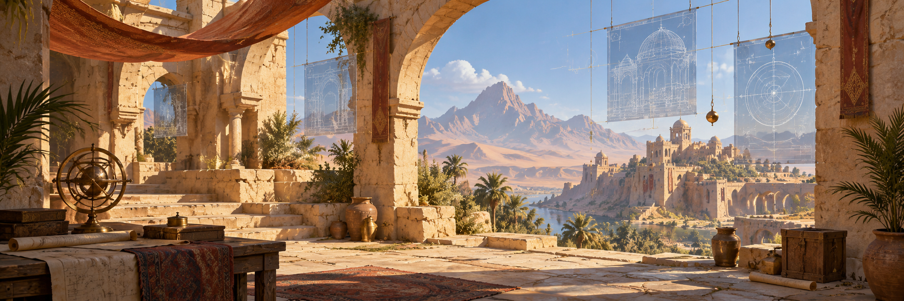

# FN_Dust2

<!-- project-header:start -->

<!-- project-header:end -->

<!-- project-badges:start -->
[](https://github.com/raiinman/FN_Dust2)
[](https://github.com/raiinman/FN_Dust2)
[](https://github.com/raiinman/FN_Dust2)
<!-- project-badges:end -->

<!-- project-live-badges:start -->
[](https://github.com/raiinman/FN_Dust2/commits/main) [](https://github.com/raiinman/FN_Dust2/issues) [](https://github.com/raiinman/FN_Dust2/stargazers)
<!-- project-live-badges:end -->

A production benchmark for building a high-fidelity, documented 1:1 Dust II environment in **Unreal Engine**, then converting the result into a **UEFN-compatible** project.

This repository is not a dump of Counter-Strike assets. The benchmark studies the map's spatial relationships, architecture, material language, lighting, and player-readable composition, then rebuilds those elements with original or properly licensed content.

## Current status

**Bootstrap complete. Active phase: Phase 1 — Reference + Metric Truth.**

Do not start the beauty pass. Do not start UEFN gameplay work. First prove the geometry.

Read in this order:

1. `AGENTS.md`
2. `docs/AGENTS.md`
3. `docs/MASTER_SPEC.md`
4. `docs/PHASES_AND_GATES.md`
5. `docs/STATE.md`
6. `docs/HANDOFF_GPT61_SOL.md`

## Production path

```
references + measurements
        ↓
deterministic Blender master geometry
        ↓
Unreal Engine blockout + fixed-camera QA
        ↓
environment kit + materials + lighting
        ↓
high-fidelity Unreal master
        ↓
UEFN compatibility/optimization pass
        ↓
Fortnite gameplay integration
```

The governing rule is simple: **never polish bad bones**.
